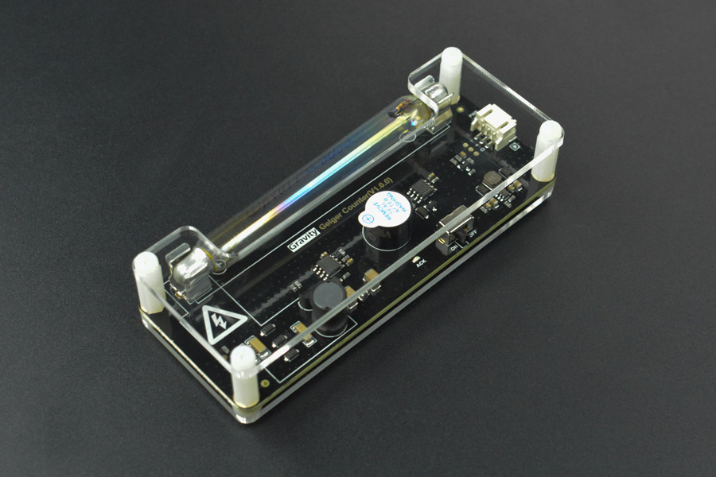
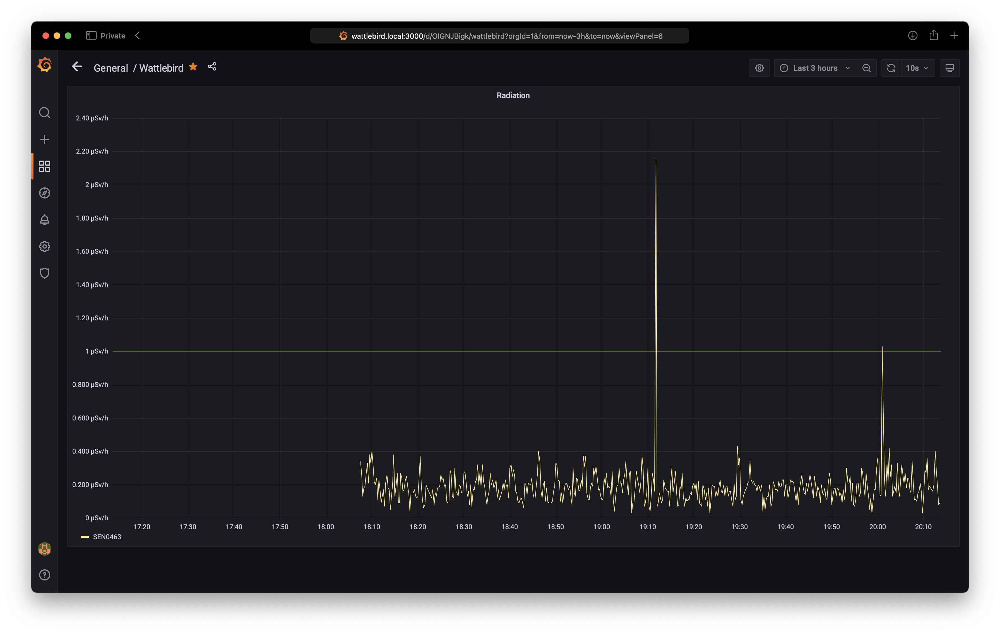

# DF Robot Gravity Geiger Counter SEN0463 radiation sensor for ESP32

An Arduino sketch for the [DF Robot Gravity Geiger Counter SEN0463 sensor](https://wiki.dfrobot.com/SKU_SEN0463_Gravity_Geiger_Counter_Module) running on an ESP32 with an http server returning [Prometheus](https://prometheus.io) compatible responses.

Based on [DFRobot_Geiger](https://github.com/cdjq/DFRobot_Geiger)



Related software:

* [Prometheus/Grafana Docker containers for Raspberry Pi](https://github.com/sighmon/prometheus-grafana-raspberry-pi)

## Features

* Reads the radiation sensor in a background task every 3 seconds
* Posts the readings to [SafeCast](https://api.safecast.org) every 30 seconds (if an API key is present)

## Setup

**WiFi**:

* Copy the secrets file: `cp secrets.tmpl.h secrets.h`
* Fill in your SSID and password in `secrets.h`

**SafeCast**:

* Sign up for an API key: api.safecast.org
* Add your API key to `secrets.h`
* Add your `latitude` and `longitude` to `secrets.h`

**Arduino**:

* Download the latest version of Arduino from https://www.arduino.cc
* Clone the [DFRobot_Geiger](https://github.com/cdjq/DFRobot_Geiger) library to `~/Documents/Arduino/libraries/`
* Connect your ESP32 via USB
* From `Tools > Board` choose your ESP32 board, port, and speed: `115200`
* Now try `Upload` to send the code to your ESP32

## Serial monitor

If you open the Arduino serial monitor you'll see:

* The WiFi output as it attempts to connect to your WiFi network
* The http response including the radiation sensor readings

## http response

Once your ESP32 has connected to your SSID, it will respond over port 80 with a [Prometheus](https://prometheus.io) response. e.g. `curl 192.168.1.100:80/metrics`

```bash
# HELP cpm CPM
# TYPE cpm gauge
cpm 27
# HELP radiation_nsvh Radiation nSv/h
# TYPE radiation_nsvh gauge
radiation_nsvh 180
# HELP radiation_usvh Radiation μSv/h
# TYPE radiation_usvh gauge
radiation_usvh 0.18
```



## Licenses

MIT License

Copyright (c) 2010 DFRobot Co.Ltd

Authors: [fengli](mailto:li.feng@dfrobot.com), [@sighmon](https://twitter.com/sighmon)
